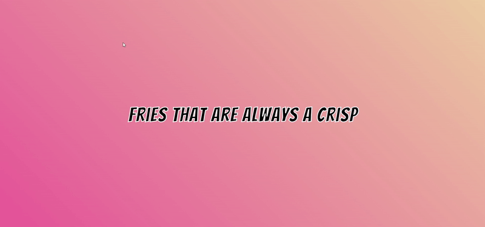

# 🍔 FoodBuzz | Fast Food Text Animation

**FoodBuzz** is a playful and eye-catching animated text project designed to spice up any fast food website, menu, or digital display. With bold outlines, changing words, and crave-worthy phrases, this animation draws attention and drives orders.

## 🚀 Profile 
<a href="https://www.linkedin.com/in/dharmendraverma95/" target="_blank">🧑‍💻 LinkedIn Profile </a> | <a href="https://www.behance.net/dhirukumar" target="_blank">🧑‍💻 Behance Profile </a>

---

### 🚀 Features

- 🍟 Animated fast food slogans with rotating keywords
- 🌈 CSS-based text outlines and styles
- 💡 Easy-to-integrate HTML, CSS, and optional JS
- ⚡ Perfect for restaurant landing pages, promotions, and digital menus

---
#### 📁 Project Structure
FoodBuzz/
├── index.html
├── styles.css
├── script.js # (Optional - for rotating word animation)
├── assets/
│ └── preview-image.png
└── README.md

#### 🎨 Fonts & Design
- Font: Bangers
- Colors: Bold reds, yellows, and whites to trigger appetite
- Outline: CSS -webkit-text-stroke for pop and contrast

#### 📦 Dependencies
- Pure HTML & CSS
- JavaScript (optional for text animation)
- Google Fonts (Bangers, Chewy, etc.)

👉 Desktop Design 
